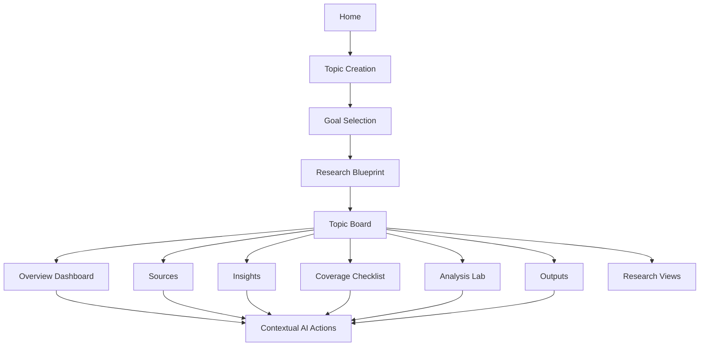

# Information Architecture

## 1. Purpose

This document defines the information architecture for Insight Workbench.

The goal is to make the product structure clear before wireframing or implementation. The IA should support a lightweight first-time experience while preserving a path toward deeper structured research.

## 2. IA Principles

### 2.1 Start Light, Deepen Gradually

Users should be able to start from one research topic without understanding the full product model. Deeper areas such as Analysis Lab, Outputs, and multiple Research Views should become available as the Topic Board develops.

### 2.2 Keep the Topic Board as the Center

Most product areas should live inside a Topic Board. Sources, insight cards, dashboard widgets, coverage checklist items, analysis artifacts, and outputs should not feel like disconnected tools.

### 2.3 Separate Global Areas from Topic-level Areas

Global areas help users start, find, or manage work. Topic-level areas help users research one topic.

### 2.4 Make AI Actions Contextual

AI should appear through actions attached to the current object or page. The IA should not make chat the main navigation destination.

## 3. Top-level Structure

```text
Insight Workbench
-> Home
-> Topic Boards
   -> Topic Board
      -> Overview Dashboard
      -> Sources
      -> Insights
      -> Coverage Checklist
      -> Analysis Lab
      -> Outputs
      -> Research Views
-> Library
-> Settings
```

For the MVP, `Home` and `Topic Board` are required. `Library` and `Settings` can be minimal or deferred if they do not support the first core flow.

## 4. Global-level Pages

### 4.1 Home

Purpose: provide the main entry point for creating or opening research work.

Primary user actions:

- Enter a research topic
- Choose or confirm a research goal
- Open recent Topic Boards
- Start from an example topic

Required MVP elements:

- Topic input
- Example prompts
- Recent Topic Boards
- Lightweight product framing

Home should not feel like a marketing landing page or a generic AI prompt screen. It should quickly lead the user into creating a Topic Board.

### 4.2 Topic Boards Index

Purpose: help users find existing Topic Boards.

Primary user actions:

- View recent boards
- Search or filter boards
- Open a board
- Create a new board

MVP status: optional if Home already includes recent boards.

### 4.3 Library

Purpose: provide a future cross-topic view of reusable sources, insight cards, and outputs.

MVP status: out of scope unless needed for navigation clarity.

### 4.4 Settings

Purpose: manage account, AI configuration, workspace preferences, or export settings.

MVP status: minimal or out of scope.

## 5. Topic-level Pages

### 5.1 Topic Board

Purpose: act as the container for one research topic.

The Topic Board is the central product object. It contains:

- Research topic
- Research goal
- Topic classification
- Research Views
- Source Library
- Insight Cards
- Research Coverage Checklist
- Dashboard Widgets
- Analysis Artifacts
- Outputs

### 5.2 Overview Dashboard

Purpose: provide the main research summary and next-step surface.

Default widgets:

- Executive brief
- Key facts
- Source coverage
- Key trends
- Major players
- Timeline
- Risks and opportunities
- Evidence gaps
- Suggested next analysis
- Research coverage checklist

Primary user actions:

- Review the current research state
- Open evidence behind a claim
- Continue from an evidence gap
- Run contextual AI actions
- Add sources
- Create an analysis artifact
- Export a brief

### 5.3 Sources

Purpose: help users collect and manage source materials.

Primary user actions:

- Upload files
- Paste links
- Add manual notes
- Review AI-recommended source categories
- Check source coverage
- Run extraction actions

The Sources page should make manual collection feel guided, not like a burden.

### 5.4 Insights

Purpose: show structured insights extracted or generated from sources.

Primary user actions:

- Review insight cards
- Edit or reject AI-generated cards
- Filter by source, topic area, confidence, or tag
- Open supporting evidence
- Run contextual AI actions

MVP status: can be included as a section inside the dashboard if a separate page is too heavy.

### 5.5 Coverage Checklist

Purpose: track which research areas are covered, missing, skipped, or need follow-up.

Primary user actions:

- Mark an area as covered
- Mark an area as skipped
- Open a missing area
- Add sources for a missing area
- Ask AI to suggest next steps

MVP status: required as a visible component. It may appear inside the dashboard and Sources page rather than as a full separate page.

### 5.6 Analysis Lab

Purpose: generate deeper structured analysis artifacts from the current Topic Board.

Initial analysis actions:

- Build SWOT
- Build PEST
- Create value chain
- Compare competitors
- Build priority matrix
- Create evidence table
- Deepen an insight

MVP status: can start as a focused set of contextual actions rather than a full standalone lab.

### 5.7 Outputs

Purpose: turn research assets into shareable deliverables.

Initial outputs:

- Research brief
- Interview preparation notes
- Report outline
- Evidence table

Primary user actions:

- Generate output from current board
- Select source references to include
- Edit generated draft
- Export or copy output

MVP status: include at least one useful text output.

### 5.8 Research Views

Purpose: allow one Topic Board to support multiple goals without duplicating sources.

Examples:

- Overview
- Job or Interview Prep
- Company Research
- Competitor Analysis
- Market Monitoring
- Consulting-style Analysis
- Content Research

Research Views should share the same Source Library and Insight Cards. A user can add a new Research View when their goal changes or deepens.

## 6. Navigation Model

The MVP should use a simple two-level navigation model:

```text
Global navigation
-> Home
-> Boards

Topic Board navigation
-> Dashboard
-> Sources
-> Insights
-> Analysis
-> Outputs
```

Recommended UI structure:

- Use global navigation for moving between Home and existing Topic Boards.
- Use Topic Board navigation after a board is opened.
- Use Research Views as tabs, segmented controls, or a compact selector within the Topic Board.
- Use contextual AI actions inside object surfaces instead of making AI a top-level page.

## 7. MVP Navigation Scope

Required for the first prototype:

- Home
- Topic creation flow
- Goal selection
- Research blueprint
- Topic Board dashboard
- Sources
- Coverage checklist component
- Basic outputs

Can be simplified:

- Insights can be a dashboard section before becoming a full page.
- Analysis Lab can be a set of dashboard actions before becoming a full page.
- Boards index can be replaced by recent boards on Home.

Out of scope for the first prototype:

- Global source library
- Team workspace navigation
- Admin console
- Template marketplace
- Community or expert contribution areas
- Full settings area

## 8. Core User Path

```text
Home
-> Enter topic
-> Confirm topic classification
-> Choose research goal
-> Review research blueprint
-> Add or confirm sources
-> Generate Topic Board
-> Review dashboard
-> Continue through coverage checklist, AI actions, analysis, or outputs
```

The core path should make source collection the first meaningful user effort, while still giving users enough AI-generated structure before they start collecting sources.

## 9. IA Diagram



## 10. Open IA Questions

- Should the first prototype show Research Views as tabs, a sidebar section, or a dropdown selector?
- Should Insight Cards be a standalone page in the MVP or part of the dashboard?
- Should Analysis Lab be a standalone page in the MVP or a collection of contextual actions?
- Should Home include a Boards index, or should recent boards be enough for the first prototype?
- How much of Settings is needed before AI integration begins?
