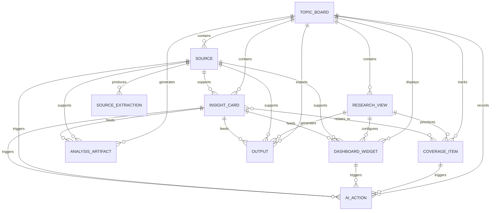

# Topic Board Information Model

## 1. Purpose

This document defines the information model for a Topic Board in Insight Workbench.

The goal is to make the product objects and relationships clear enough to guide future wireframes, data schema decisions, AI workflow design, and implementation.

## 2. Model Principles

### 2.1 One Topic Board, Shared Evidence

A Topic Board should contain one shared Source Library and one shared set of Insight Cards. Research Views should reuse these shared assets instead of duplicating sources for each user goal.

### 2.2 Views Change the Lens, Not the Evidence

Research Views represent different ways to look at the same topic. They can change dashboard templates, highlighted insights, and recommended outputs, but they should not create a separate evidence base.

### 2.3 Claims Should Trace Back to Sources

Dashboard Widgets, Insight Cards, Analysis Artifacts, and Outputs should preserve source links where possible. When a statement is not directly supported by a source, it should be marked as an assumption or inference.

### 2.4 AI-generated Objects Are Drafts

AI-generated insights, widgets, artifacts, and outputs should be reviewable and editable. The model should support draft, reviewed, and rejected states.

### 2.5 Coverage Is a First-class Object

Research coverage should not be treated as hidden AI memory. Coverage Checklist items should be visible objects connected to sources, insights, and follow-up actions.

## 3. Core Object Map

```text
Topic Board
-> Research Views
-> Source Library
   -> Sources
      -> Source Extractions
-> Insight Cards
-> Research Coverage Checklist
   -> Research Coverage Items
-> Dashboard Widgets
-> Analysis Artifacts
-> Outputs
-> AI Actions
```

## 4. Object Relationship Diagram



## 5. Object Definitions

### 5.1 Topic Board

Role: the central workspace for one research topic.

Required fields:

- `id`
- `title`
- `topic_type`
- `primary_research_goal`
- `status`
- `created_at`
- `updated_at`

Optional fields:

- `description`
- `scope_note`
- `source_coverage_summary`
- `default_view_id`

Status values:

- `draft`
- `active`
- `archived`

Relationships:

- has many Research Views
- has many Sources
- has many Insight Cards
- has many Research Coverage Items
- has many Dashboard Widgets
- has many Analysis Artifacts
- has many Outputs

### 5.2 Research View

Role: a goal-specific lens inside a Topic Board.

Required fields:

- `id`
- `topic_board_id`
- `view_type`
- `title`
- `goal`
- `created_at`

Optional fields:

- `description`
- `dashboard_template`
- `is_primary`
- `sort_order`

View types:

- `overview`
- `job_interview_prep`
- `company_research`
- `competitor_analysis`
- `market_monitoring`
- `consulting_style_analysis`
- `content_research`
- `custom`

Relationships:

- belongs to one Topic Board
- uses shared Sources
- uses shared Insight Cards
- prioritizes Research Coverage Items
- configures Dashboard Widgets
- generates Outputs

### 5.3 Source

Role: a piece of evidence or context attached to a Topic Board.

Required fields:

- `id`
- `topic_board_id`
- `title`
- `source_type`
- `source_category`
- `status`
- `created_at`

Optional fields:

- `url`
- `file_path`
- `source_date`
- `author_or_publisher`
- `reliability_level`
- `tags`
- `notes`

Source types:

- `file`
- `link`
- `manual_note`
- `web_reference`

Source categories:

- `official_website`
- `company_report`
- `policy_or_regulation`
- `industry_association`
- `research_report`
- `news`
- `competitor_website`
- `company_database`
- `recruiting_or_job_market`
- `social_or_community_discussion`
- `video_or_article`
- `first_hand_observation`
- `other`

Status values:

- `recommended`
- `added`
- `extracting`
- `extracted`
- `failed`
- `ignored`

Relationships:

- belongs to one Topic Board
- produces Source Extractions
- supports Insight Cards
- supports Dashboard Widgets
- supports Analysis Artifacts
- supports Outputs

### 5.4 Source Extraction

Role: structured information extracted from a Source.

Required fields:

- `id`
- `source_id`
- `extraction_type`
- `status`
- `created_at`

Optional fields:

- `content`
- `confidence_level`
- `error_message`

Extraction types:

- `fact`
- `claim`
- `entity`
- `timeline_event`
- `quote`
- `data_point`
- `sentiment`
- `summary`

Status values:

- `pending`
- `extracted`
- `reviewed`
- `rejected`
- `failed`

Relationships:

- belongs to one Source
- can create or support Insight Cards

### 5.5 Insight Card

Role: a structured research insight that can be reviewed, edited, and reused.

Required fields:

- `id`
- `topic_board_id`
- `title`
- `claim`
- `status`
- `confidence_level`
- `created_at`

Optional fields:

- `summary`
- `supporting_evidence`
- `source_ids`
- `assumption_note`
- `tags`
- `insight_type`

Insight types:

- `fact`
- `trend`
- `risk`
- `opportunity`
- `player`
- `market_structure`
- `policy_context`
- `demand_behavior`
- `contradiction`
- `assumption`

Status values:

- `draft`
- `reviewed`
- `edited`
- `rejected`

Relationships:

- belongs to one Topic Board
- supported by many Sources
- can feed Dashboard Widgets
- can feed Analysis Artifacts
- can feed Outputs
- can relate to Research Coverage Items

### 5.6 Research Coverage Item

Role: a visible research area that is covered, missing, skipped, or needs follow-up.

Required fields:

- `id`
- `topic_board_id`
- `area`
- `status`
- `created_at`

Optional fields:

- `research_view_id`
- `recommendation`
- `related_source_ids`
- `related_insight_ids`
- `priority`
- `notes`

Status values:

- `not_started`
- `needs_sources`
- `in_progress`
- `covered`
- `skipped`
- `needs_follow_up`

Relationships:

- belongs to one Topic Board
- may be prioritized by one or more Research Views
- can connect to Sources
- can connect to Insight Cards
- can trigger AI Actions

### 5.7 Dashboard Widget

Role: a dashboard block that summarizes or visualizes part of the research board.

Required fields:

- `id`
- `topic_board_id`
- `widget_type`
- `title`
- `status`
- `sort_order`

Optional fields:

- `research_view_id`
- `content`
- `source_ids`
- `insight_card_ids`
- `confidence_level`
- `last_generated_at`

Widget types:

- `executive_brief`
- `key_facts`
- `source_coverage`
- `key_trends`
- `major_players`
- `timeline`
- `risks_opportunities`
- `evidence_gaps`
- `suggested_next_analysis`
- `coverage_checklist`

Status values:

- `empty`
- `draft`
- `reviewed`
- `needs_update`
- `hidden`

Relationships:

- belongs to one Topic Board
- may belong to one Research View
- can be supported by Sources
- can be fed by Insight Cards
- can trigger AI Actions

### 5.8 Analysis Artifact

Role: a deeper structured analysis generated from Topic Board content.

Required fields:

- `id`
- `topic_board_id`
- `artifact_type`
- `title`
- `status`
- `created_at`

Optional fields:

- `research_view_id`
- `content`
- `source_ids`
- `insight_card_ids`
- `method_note`
- `confidence_level`

Artifact types:

- `swot`
- `pest`
- `value_chain`
- `competitor_comparison`
- `priority_matrix`
- `maturity_assessment`
- `timeline`
- `evidence_table`

Status values:

- `draft`
- `reviewed`
- `edited`
- `needs_update`

Relationships:

- belongs to one Topic Board
- may belong to one Research View
- generated from Sources and Insight Cards
- can feed Outputs

### 5.9 Output

Role: a shareable deliverable generated from the Topic Board or a Research View.

Required fields:

- `id`
- `topic_board_id`
- `output_type`
- `title`
- `status`
- `created_at`

Optional fields:

- `research_view_id`
- `content`
- `source_ids`
- `insight_card_ids`
- `analysis_artifact_ids`
- `export_format`

Output types:

- `research_brief`
- `interview_notes`
- `report_outline`
- `evidence_table`

Status values:

- `draft`
- `reviewed`
- `edited`
- `exported`

Relationships:

- belongs to one Topic Board
- may belong to one Research View
- generated from Dashboard Widgets, Insight Cards, Analysis Artifacts, and Sources

### 5.10 AI Action

Role: a recorded AI-powered action performed in context.

Required fields:

- `id`
- `topic_board_id`
- `action_type`
- `target_type`
- `target_id`
- `status`
- `created_at`

Optional fields:

- `research_view_id`
- `input_summary`
- `output_summary`
- `generated_object_ids`
- `error_message`

Action types:

- `generate_blueprint`
- `recommend_sources`
- `extract_facts`
- `create_insight_cards`
- `find_evidence`
- `challenge_claim`
- `deepen_analysis`
- `build_matrix`
- `generate_brief`
- `suggest_next_steps`

Status values:

- `queued`
- `running`
- `completed`
- `failed`
- `dismissed`

Relationships:

- belongs to one Topic Board
- may belong to one Research View
- targets a Source, Insight Card, Dashboard Widget, Coverage Item, Analysis Artifact, Output, or Topic Board
- may generate new objects

## 6. Lifecycle

### 6.1 Topic Board Lifecycle

```text
Draft
-> Active
-> Archived
```

Draft: the user has entered a topic and may be reviewing goal selection or blueprint.

Active: the board has been created and can contain sources, dashboard widgets, insights, analysis artifacts, and outputs.

Archived: the board is no longer active but remains accessible.

### 6.2 Source Lifecycle

```text
Recommended
-> Added
-> Extracting
-> Extracted
-> Reviewed
```

Alternative paths:

```text
Recommended -> Ignored
Extracting -> Failed
Extracted -> Re-extracting
```

### 6.3 Insight Card Lifecycle

```text
Draft
-> Reviewed
-> Edited
```

Alternative path:

```text
Draft -> Rejected
```

### 6.4 Coverage Item Lifecycle

```text
Not started
-> Needs sources
-> In progress
-> Covered
```

Alternative paths:

```text
Needs sources -> Skipped
Covered -> Needs follow-up
```

## 7. Shared Evidence Rules

Research Views should not duplicate:

- Sources
- Source Extractions
- Insight Cards
- Research Coverage Items

Research Views may customize:

- Dashboard Widget configuration
- Highlighted Insight Cards
- Coverage priority
- Suggested AI Actions
- Output templates

This keeps one Topic Board coherent even when users use the same topic for multiple goals.

## 8. MVP Simplification

The first prototype does not need a complete database schema. It can use a simplified in-memory or static data model that follows the same object relationships.

Minimum useful model for the first prototype:

- Topic Board
- Research View
- Source
- Insight Card
- Research Coverage Item
- Dashboard Widget
- Output

Can be simplified or deferred:

- Source Extraction can be represented as generated Insight Cards.
- AI Action can be represented as UI actions without persistent action history.
- Analysis Artifact can begin as a dashboard section or generated output.
- Library-level reuse can be deferred.

## 9. Implementation Notes for Later

Future implementation should preserve these constraints:

- Use stable object IDs so sources, insights, widgets, and outputs can reference each other.
- Store source references separately from generated text where possible.
- Keep status fields explicit so the UI can show drafts, missing coverage, weak evidence, and failed extractions.
- Avoid building separate duplicated boards for each research goal.
- Keep AI-generated content editable and reviewable.
- Preserve the distinction between source-grounded claims, assumptions, and unsupported statements.

## 10. Open Questions

- Should Research Coverage Items belong directly to a Topic Board, a Research View, or both?
- Should Dashboard Widgets be generated per Research View or shared globally with view-specific filters?
- Should AI Action history be visible to users in the MVP?
- Should Source Extractions be stored as independent objects or folded into Insight Cards for the first prototype?
- What is the minimum source reference structure needed for useful output export?
